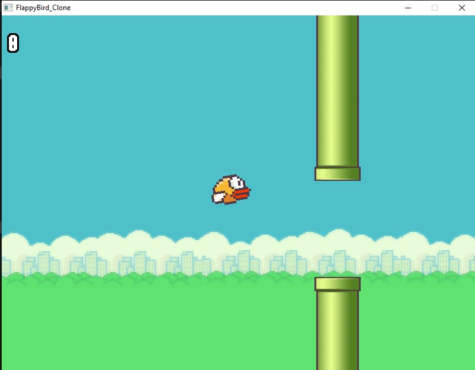
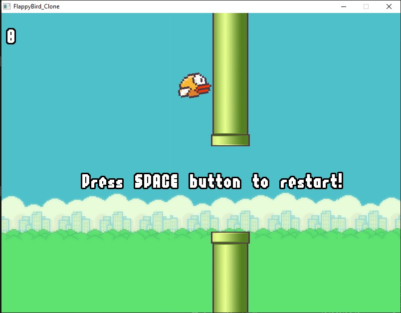

# FlappyBird-Clone

## Dependencies
+ SFML
+ MinGW 
+ Makefile

## Installation 

```
git clone https://github.com/Ozsbourn/FlappyBird-Clone
cd FlappyBird-Clone
make
make clean
``` 

## Screenshots



